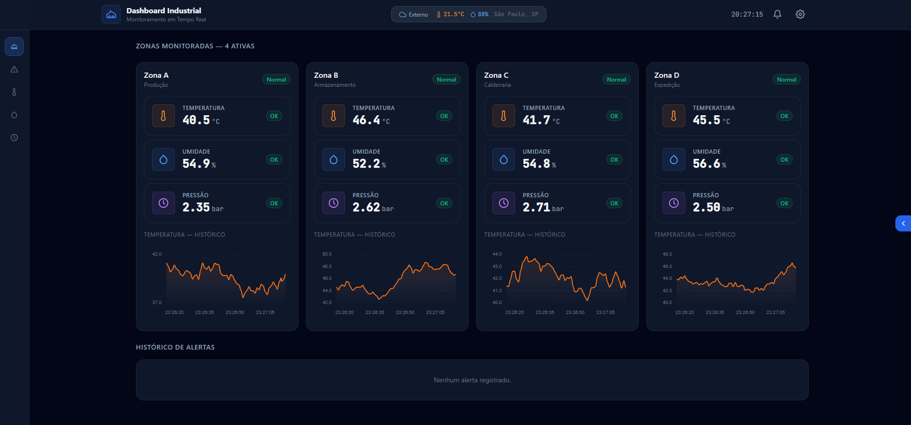

<div align="center">

  <h1>🏭 Dashboard Industrial</h1>

  <p>
    Painel de monitoramento em tempo real de sensores industriais.<br/>
    Temperatura · Umidade · Pressão — por zonas de fábrica.
  </p>

  [](https://react.dev)
  [](https://vitejs.dev)
  [](https://tailwindcss.com)
  [](https://zustand-demo.pmnd.rs)
  [](./LICENSE)

</div>

---

## 📸 Screenshots

<div align="center">
  
</div>

---

## 📋 Sobre o projeto

O **Dashboard Industrial** simula um painel de controle de uma fábrica com múltiplas zonas de monitoramento. Cada zona exibe leituras em tempo real de **temperatura**, **umidade** e **pressão**, com sistema de alertas automático quando os sensores ultrapassam os limites configurados.

Desenvolvido como projeto de portfólio para demonstrar habilidades em:
- Arquitetura de componentes React com separação de responsabilidades
- Gerenciamento de estado global com Zustand + persistência no localStorage
- Simulação de dados em tempo real com perfis de curva realistas
- Integração com API pública externa (Open-Meteo) sem chave de acesso
- Design system industrial com Tailwind CSS

---

## ✨ Funcionalidades

- 📊 **Gráficos em tempo real** — histórico das últimas 60 leituras por zona
- 🚨 **Sistema de alertas** — notificações com nível warning/critical e cooldown
- 🔔 **Painel de alertas** — dropdown no header com descarte individual ou em lote
- 🌤️ **Clima externo** — temperatura e umidade da cidade da fábrica via Open-Meteo
- 🔍 **Busca de cidade** — autocomplete com geocoding (sem cadastro, sem chave)
- ⏱️ **Uptime do sistema** — contador ao vivo de tempo ativo desde a abertura do painel
- 📥 **Exportar CSV** — exporta leituras de todas as zonas com timestamp, compatível com Excel
- ⚙️ **Configurações persistidas** — zonas, limites dos sensores e localização salvos
- 📍 **Multi-zonas** — adiciona, edita e remove zonas dinamicamente
- 🎛️ **Sidebar navegável** — filtra o dashboard por tipo de sensor
- 🍞 **Toasts de alerta** — notificações visuais com descarte individual
- 📱 **Responsivo** — adaptado para desktop e tablets

---

## 🛠️ Tecnologias

| Camada        | Tecnologia                          |
|---------------|-------------------------------------|
| Framework     | React 18 + Vite 5                   |
| Estilo        | Tailwind CSS 3                      |
| Estado global | Zustand 5 + persist middleware      |
| Gráficos      | ApexCharts + react-apexcharts       |
| API de clima  | Open-Meteo (gratuita, sem chave)    |
| Geocoding     | Open-Meteo Geocoding API            |
| Tipografia    | Inter + JetBrains Mono (local)      |

---

## 🗂️ Estrutura do projeto

```
dashboard-fabrica/
├── public/
│   └── favicon.svg
├── src/
│   ├── assets/
│   │   ├── fonts/
│   │   └── screenshot/
│   ├── components/
│   │   ├── dashboard/
│   │   │   ├── AlertsTable.jsx
│   │   │   ├── KpiCard.jsx
│   │   │   ├── SensorChart.jsx
│   │   │   └── ZonePanel.jsx
│   │   ├── layout/
│   │   │   ├── ConfigDrawer.jsx
│   │   │   ├── Header.jsx
│   │   │   └── Sidebar.jsx
│   │   └── ui/
│   │       ├── icons/
│   │       │   └── SensorIcons.jsx
│   │       ├── Badge.jsx
│   │       ├── CitySearch.jsx
│   │       └── Toast.jsx
│   ├── hooks/
│   │   ├── useSensorData.js
│   │   ├── useUptime.js
│   │   └── useWeatherData.js
│   ├── services/
│   │   └── weatherService.js
│   ├── store/
│   │   └── useAppStore.js
│   ├── utils/
│   │   ├── alertChecker.js
│   │   ├── exportCSV.js
│   │   └── sensorSimulator.js
│   ├── App.css
│   ├── App.jsx
│   ├── index.css
│   └── main.jsx
├── .gitignore
├── eslint.config.js
├── index.html
├── package.json
├── tailwind.config.js
└── vite.config.js
```

---

## 🚀 Como rodar localmente

**Pré-requisitos:** Node.js 18+ e npm 9+

```bash
# 1. Clone o repositório
git clone https://github.com/alberto2santos/dashboard-fabrica.git

# 2. Entre na pasta
cd dashboard-fabrica

# 3. Instale as dependências
npm install

# 4. Inicie o servidor de desenvolvimento
npm run dev
```

Acesse **http://localhost:5173** no navegador.

---

## 📦 Scripts disponíveis

```bash
npm run dev      # Servidor de desenvolvimento com HMR
npm run build    # Build de produção na pasta dist/
npm run preview  # Preview do build de produção
npm run lint     # Análise de código com ESLint
```

---

## 🔌 APIs externas utilizadas

| API | Uso | Autenticação |
|-----|-----|--------------|
| [Open-Meteo Weather](https://open-meteo.com) | Clima atual por coordenadas | ✅ Gratuita, sem chave |
| [Open-Meteo Geocoding](https://geocoding-api.open-meteo.com) | Busca de cidades por nome | ✅ Gratuita, sem chave |

---

<div align="center">
  Desenvolvido por <a href="https://github.com/alberto2santos">Alberto Luiz</a>
</div>

---